# Kingdom's Last Stand

> A wave-based tower defense game where strategic spending and precise tower placement are the only things standing between your kingdom and total annihilation.

---

## 1. Project Overview

### Project Name
**Kingdom's Last Stand**

### Brief Description

Kingdom's Last Stand is a single-player **wave-based tower defense game** built with Python 3 and Pygame. The player takes the role of a Commander defending a castle against 10 waves of escalating enemy invasions. Using a limited supply of gold, the player must strategically purchase and position three types of towers — Archer, Mage, and Cannon — on a fixed map to stop enemies from reaching the castle. Each wave introduces stronger and faster enemies, and every decision about where to spend gold matters.

Beyond the gameplay itself, the game features a full **statistics tracking system** that records performance data every wave and stores it in a CSV file. After each session, players can explore an interactive Statistics screen with 6 data visualizations — from a leaderboard to a heatmap — letting them analyze their own performance and compare it against every other session ever recorded.

### Problem Statement

Most tower defense games give players no insight into their own performance beyond a simple win/loss result. This project solves that by treating the game as a **data collection platform**: every wave is recorded with enemies defeated, damage dealt, gold spent, castle HP, and time survived. The statistical analysis screen then reveals patterns that are impossible to see in-game — which wave kills most players, who spent their gold most efficiently, and how much damage it actually takes to clear a Boss wave.

### Target Users

- **Casual gamers** who enjoy strategy and tower defense games
- **Students** learning Python game development with Pygame
- **Data enthusiasts** interested in how gameplay statistics are collected and visualized in real time

### Key Features

- **3 tower types** with distinct abilities: Archer (critical hits), Mage (enemy slow), Cannon (area splash damage)
- **10 waves** of enemies with 9 enemy types ranging from Slime to Dragon Boss, each scaling in HP and speed per wave
- **5 playable maps** with unique waypoint paths
- **Tower upgrade system** — each tower can be leveled up for 1.5× damage and 1.2× range
- **4 targeting modes** per tower: First, Last, Strongest, Closest
- **Automatic CSV data recording** — every wave saved to `data/game_stats.csv`
- **Interactive Statistics screen** with 6 graphs: Summary Table, Leaderboard, Gold/Wave Scatter, Damage Efficiency, Survival Curve, Wave Heatmap

### Screenshots

#### Gameplay

**Home Screen**

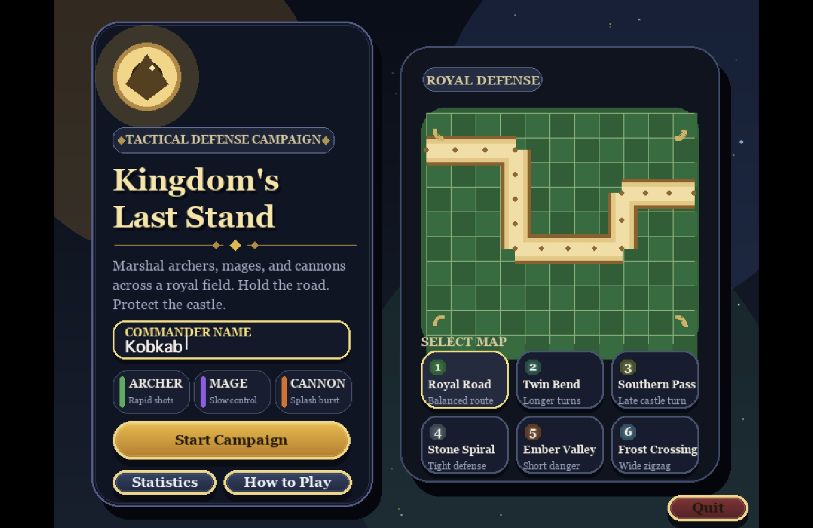

The Home screen lets the player enter a Commander name and choose from 6 maps, each with a unique enemy path. Tower types (Archer, Mage, Cannon) are previewed at the bottom with their key trait.

---

**Before Wave 1 — Pre-wave setup**

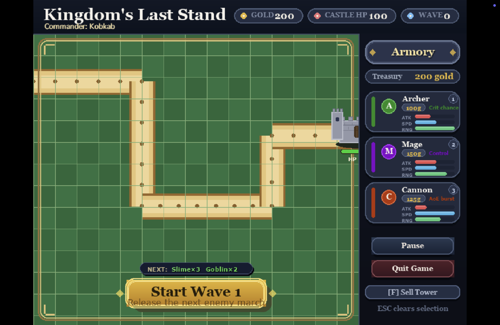

The map is loaded and the path is visible. The player starts with 200 gold and has not yet placed any towers. The HUD shows the upcoming enemies (Slime×3, Goblin×2) and the Start Wave button is ready.

---

**Wave 5 — Mid-game combat**

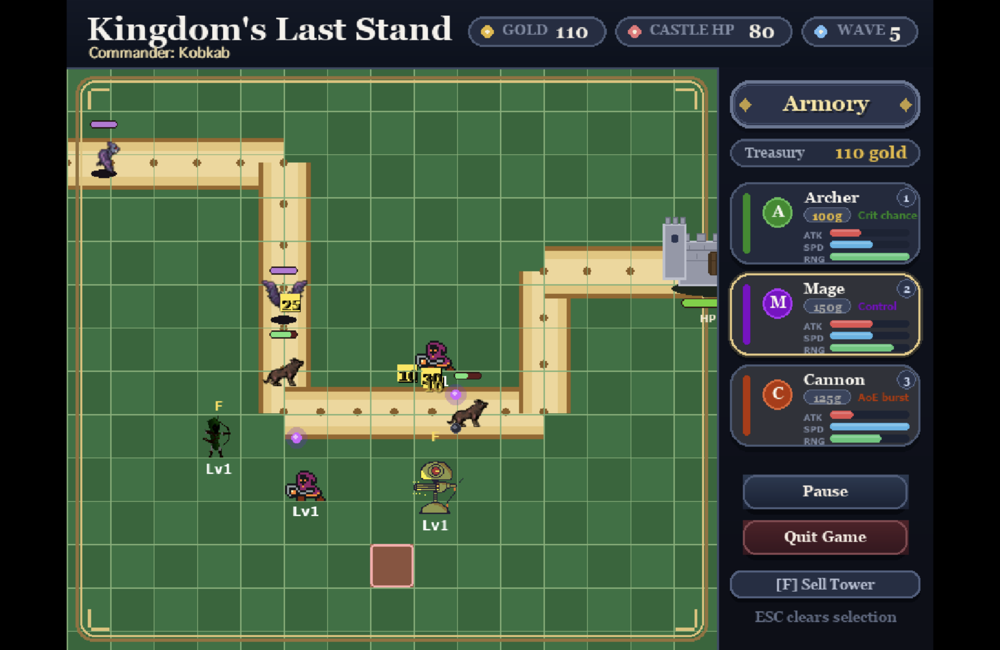

Wave 5 is active with multiple enemy types on the path — Dark Knights and Spiders moving toward the castle. Towers (Archer, Mage, Cannon) are placed at key turns. Castle HP has dropped to 80 and gold is down to 110, showing the cost of defending.

---

**Pause Menu**

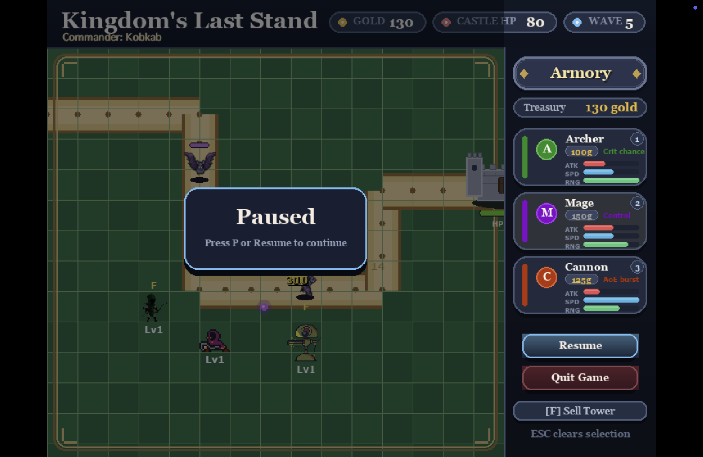

Pressing P pauses the game mid-wave. The pause overlay appears over the battlefield, and the Armory panel switches to show Resume and Quit Game buttons. The current wave state (Wave 5, Castle HP 80) is preserved.

---

**Wave 10 — Final Boss wave**

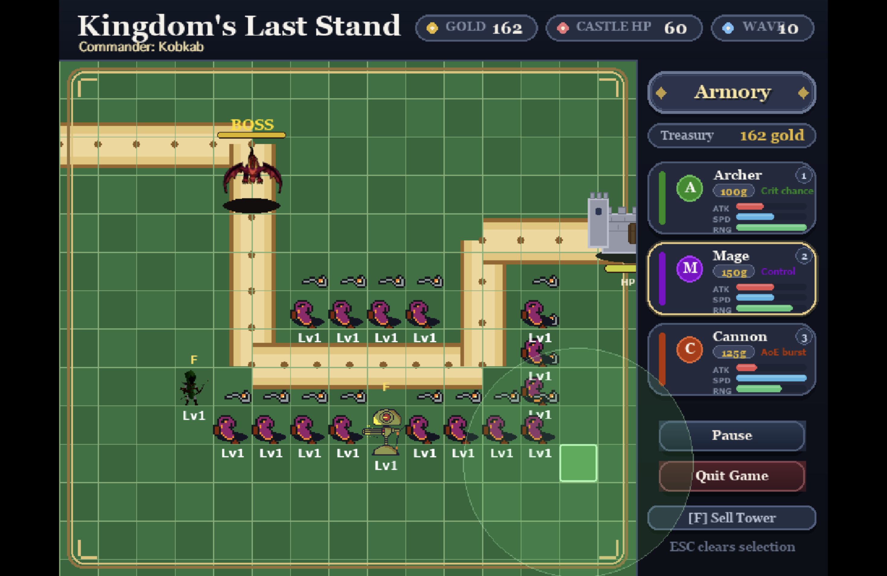

The Dragon Boss labeled **BOSS** leads a massive wave of Dark Knights flooding the entire path. This is the hardest moment in the game — Castle HP is at 60 and the player must survive this wave to achieve Victory. Every tower is essential.

---

**How to Play — Page 1: Hold the Road**

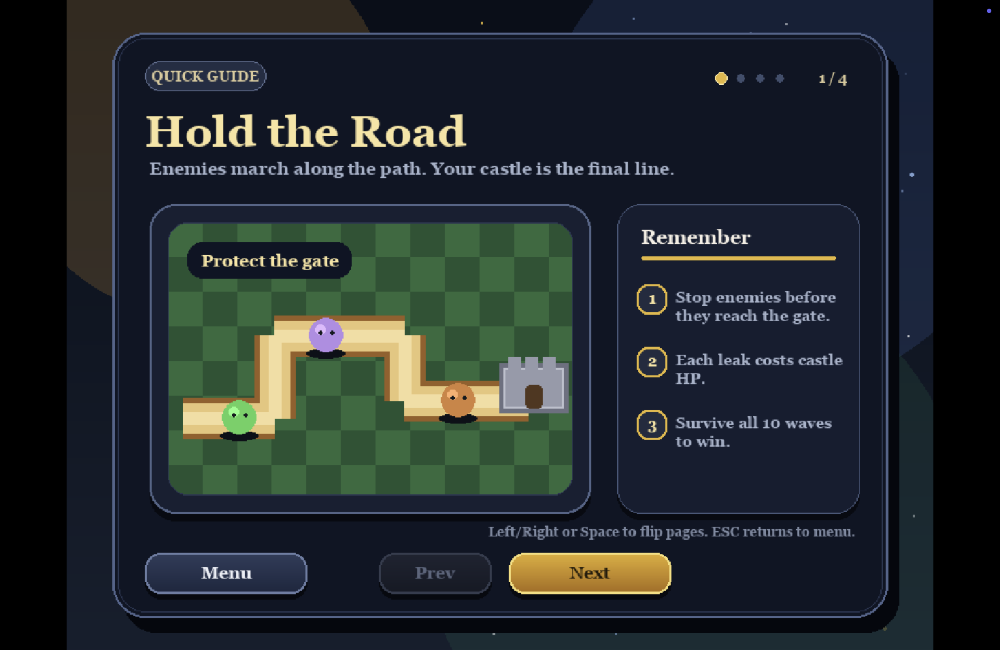

The Quick Guide explains the core objective: stop enemies before they reach the castle gate. Each enemy that leaks through costs castle HP. Survive all 10 waves to win.

---

**How to Play — Page 2: Build Smart**

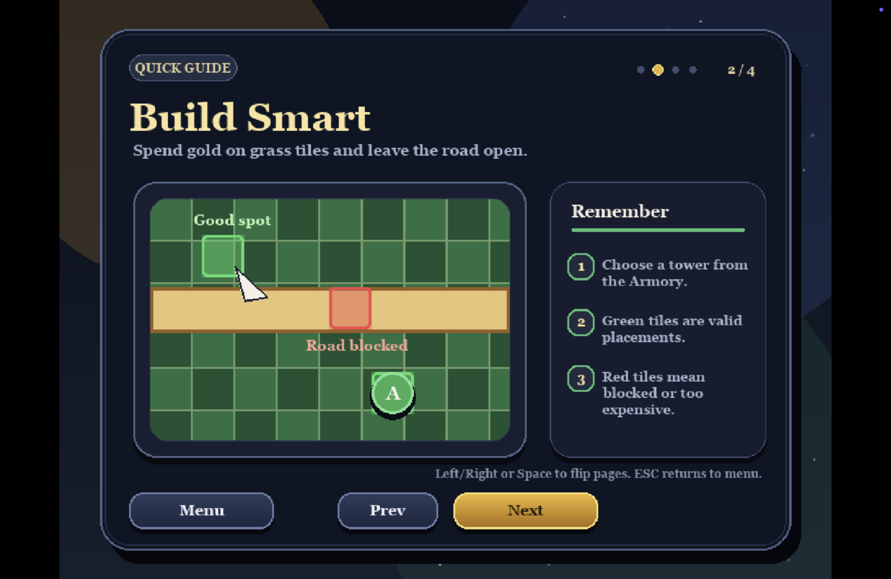

The guide shows tower placement rules — green tiles are valid spots on the grass, red tiles mean the path is blocked or the player cannot afford the tower. Towers must be placed off the road.

---

**How to Play — Page 3: Pick a Role**

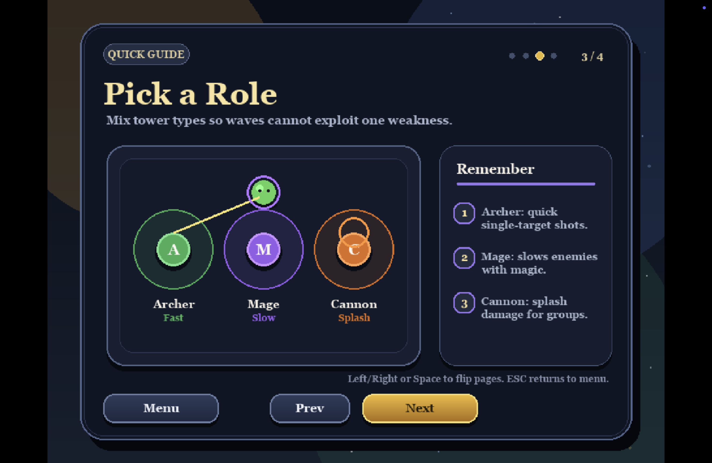

Each tower fills a different role: Archer deals fast single-target damage, Mage slows enemies with magic, and Cannon hits groups with splash damage. Mixing all three prevents any wave composition from exploiting a single weakness.

---

**How to Play — Page 4: Fast Controls**

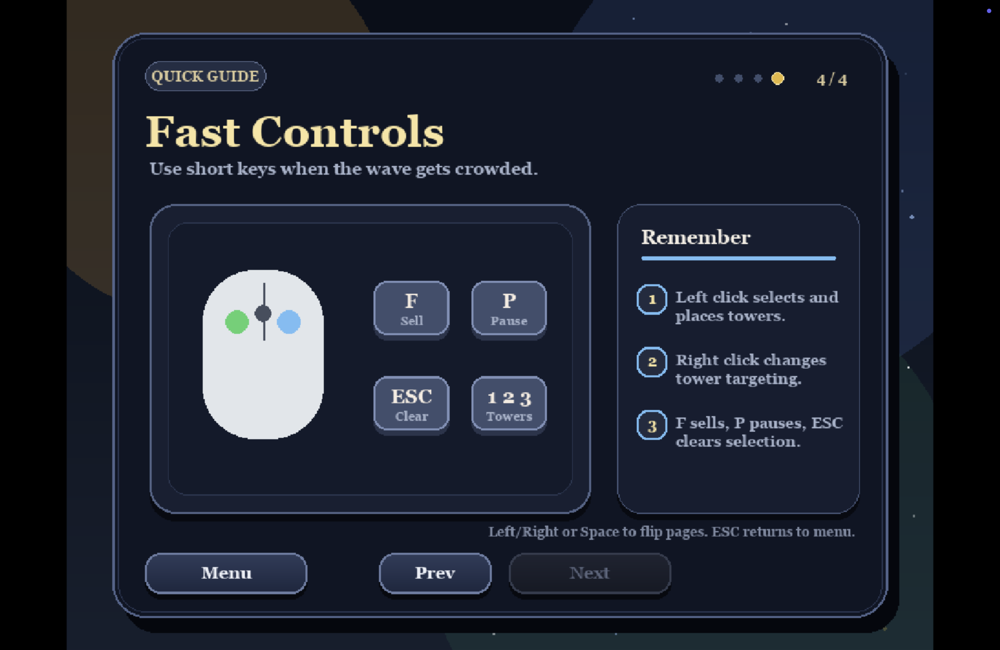

The controls page covers all shortcuts — Left click to place towers, Right click to cycle targeting mode, `1`/`2`/`3` to select tower types, `F` to sell, `P` to pause, and `ESC` to clear selection.

---

**Game Over**

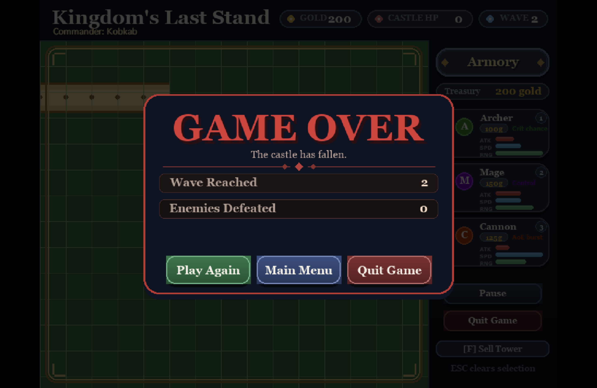

When Castle HP reaches 0, the Game Over screen appears showing Wave Reached and Enemies Defeated for the session. The player can Play Again, return to Main Menu, or Quit.

---

**Victory**

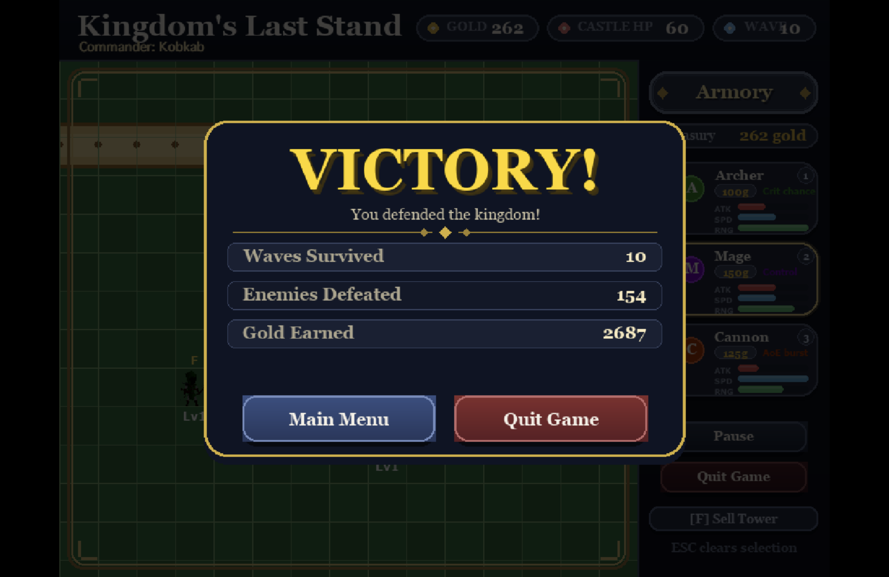

Surviving all 10 waves triggers the Victory screen. The summary shows Waves Survived (10), Enemies Defeated (154), and total Gold Earned (2,687). The kingdom has been defended.

---

#### Statistics

**Statistics Overview — Summary Table**

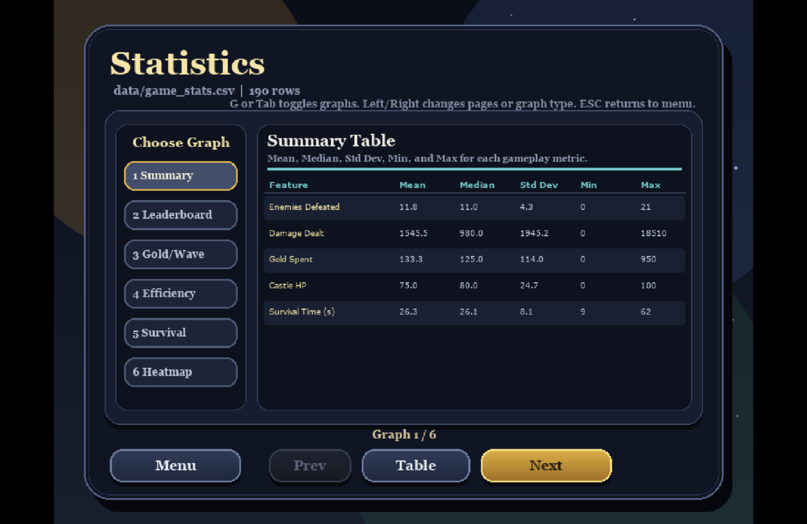

The Statistics screen shows data from all recorded sessions. The left sidebar lists 6 graphs; the main panel displays the selected visualization with a supporting data table.

**Leaderboard** — Top players ranked by wave reached then total damage.

**Gold Spent vs Wave Reached** — Scatter plot showing spending efficiency. Green dots are "Good Value" players who reached high waves with low gold.

**Damage Efficiency** — Damage dealt per gold spent. Higher means smarter tower spending.

**Survival Curve** — Average castle HP per wave across all players. Sharp drops mark the most dangerous waves.

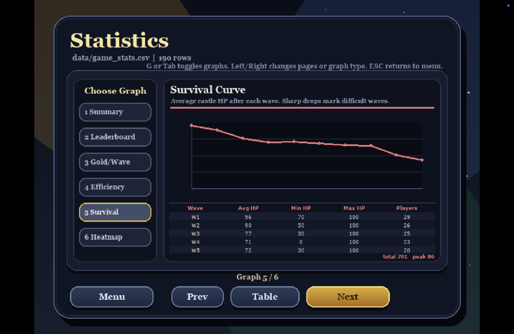

**Wave Survival Heatmap** — How many players survived each wave. Brighter cells mean more players reached that wave.

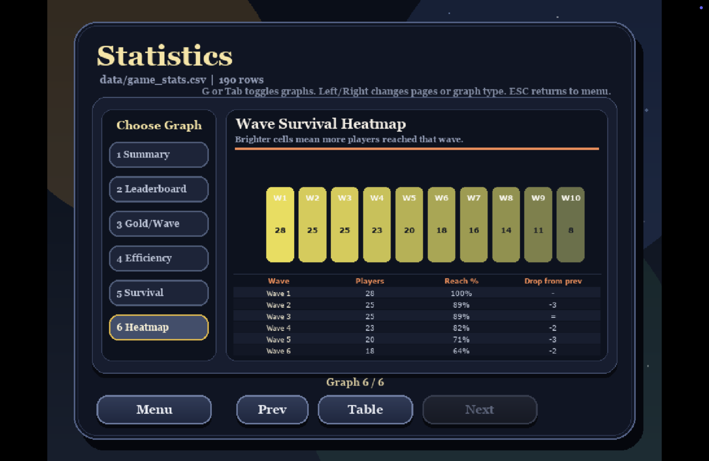

### Proposal

📄 [Project Proposal (PDF)](6810545662%20thanutdit%20Game%20Project%20proposal.pdf)

### Video Presentation

🎬 [YouTube Presentation](https://www.youtube.com/) *(add link here)*

The video covers:
1. Full demonstration of the game and all statistics features
2. Explanation of the class design and OOP structure
3. Walkthrough of all 6 statistical visualizations and the data behind them

---

## 2. Concept

### 2.1 Background

Tower defense games have been a staple of strategy gaming for decades, yet most implementations focus purely on the play experience and discard all the data generated during a session the moment the game ends. This project was inspired by the question: *what if a tower defense game also functioned as a live data experiment?*

Every decision a player makes — which tower to buy, when to upgrade, which targeting mode to use — directly affects measurable outcomes: enemies defeated, damage dealt, castle HP remaining, and gold spent. By capturing this data every wave and persisting it to CSV, the game becomes a platform for statistical analysis. Players can not only see how they performed, but understand *why* — and compare themselves to every other Commander who has played.

The game's difficulty design is intentional. Enemy HP scales by 1.20× per wave and speed by 1.10×, creating an exponential difficulty curve that eventually overwhelms any static tower setup. This ensures the data is meaningful: a player who reaches Wave 10 with full castle HP made genuinely better decisions than one who died at Wave 4, and the statistics screen makes that difference visible and quantifiable.

### 2.2 Objectives

- **Build a complete, playable tower defense game** with coherent progression across 10 waves
- **Implement a persistent data recording system** that automatically captures per-wave statistics without any player input
- **Visualize gameplay data** through 6 distinct chart types that each answer a different analytical question about player behavior
- **Apply OOP principles** through a clean inheritance hierarchy for towers, enemies, and projectiles
- **Demonstrate data analysis** using pandas for summary statistics and matplotlib for in-game chart rendering

---

## 3. UML Class Diagram

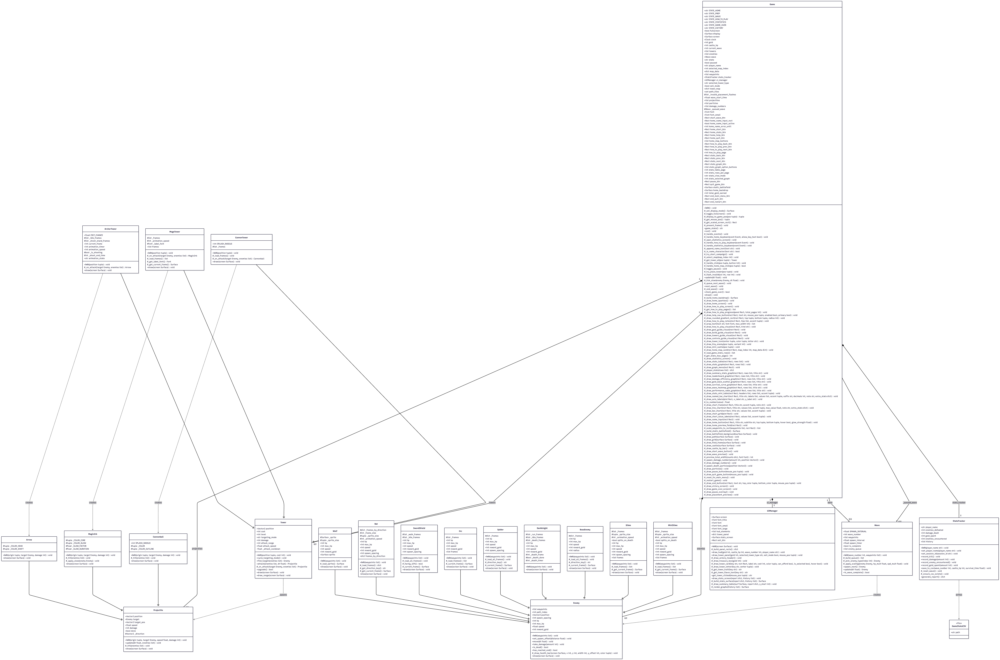

The diagram shows all major classes with their attributes, methods, and relationships including inheritance (Tower → ArcherTower / MageTower / CannonTower), composition (Game contains Wave, StatsTracker, UIManager, lists of Tower/Enemy/Projectile), and dependency (Tower fires Projectile, Projectile hits Enemy).

---

## 4. Object-Oriented Programming Implementation

| Class | File | Role |
|---|---|---|
| **Game** | `src/game.py` | Central controller — manages the game loop, all states (home, playing, statistics, game over), tower placement, enemy spawning, collision detection, and wave progression |
| **Tower** | `src/towers/tower.py` | Base class for all towers. Handles targeting logic (4 modes), attack cooldown, range checking, upgrade system, and drawing |
| **ArcherTower** | `src/towers/archer_tower.py` | Tower subclass with 20% critical hit chance. Fires `Arrow` projectiles. Frame-based sprite animation |
| **MageTower** | `src/towers/mage_tower.py` | Tower subclass that fires `MagicOrb` projectiles which apply a 50% slow for 2 seconds on hit |
| **CannonTower** | `src/towers/cannon_tower.py` | Tower subclass with 50px area splash damage. Fires `Cannonball` projectiles. Sprite sheet animation |
| **Projectile** | `src/projectiles.py` | Base class for all projectiles. Tracks a target, moves toward its last known position, and triggers a hit callback |
| **Arrow** | `src/projectiles.py` | Fast (400 speed) straight-line projectile |
| **MagicOrb** | `src/projectiles.py` | Slow (250 speed) projectile that calls `apply_slow()` on hit |
| **Cannonball** | `src/projectiles.py` | Medium (210 speed) projectile that applies splash damage in a radius |
| **Enemy** | `src/enemies/enemy.py` | Base class for all enemies. Waypoint-based pathfinding, HP/speed scaling per wave, health bar rendering, directional sprite animation |
| **Slime** | `src/enemies/slime.py` | Enemy that splits into two MiniSlime on death |
| **MiniSlime** | `src/enemies/slime.py` | Spawned by Slime death, awards no gold |
| **Goblin** | `src/enemies/goblin.py` | Standard enemy, fast and low HP |
| **Bat** | `src/enemies/bat.py` | Flying unit with directional sprite animation |
| **SwordShield** | `src/enemies/swordshield.py` | Heavier Goblin variant with more HP |
| **Orc** | `src/enemies/orc.py` | Tank unit with high HP and slow speed |
| **Spider** | `src/enemies/spider.py` | Fast mid-game enemy |
| **DarkKnight** | `src/enemies/dark_knight.py` | Elite enemy with 300 HP, introduced at Wave 9 |
| **BossEnemy** | `src/enemies/boss_enemy.py` | Dragon with 750 HP, spawned at Wave 5 and Wave 10 |
| **Wave** | `src/wave.py` | Manages enemy spawn queue with 1.5-second intervals. Applies HP and speed scaling. Inserts Boss on Wave 5 and 10 |
| **StatsTracker** | `src/stats_tracker.py` | Records per-wave statistics (kills, damage, gold, HP, time) and appends them to `data/game_stats.csv`. Computes summary statistics using pandas |
| **UIManager** | `src/ui_manager.py` | Draws the HUD bar, right-side tower panel with stat bars, and the end-game matplotlib chart screen |

---

## 5. Statistical Data

### 5.1 Data Recording Method

After every completed wave, `StatsTracker.save_to_csv()` is called automatically by the `Game` class. It appends one row to `data/game_stats.csv` containing the player's name and five numeric measurements for that wave. The file is created with headers on first run and appended on every subsequent session — meaning data accumulates across all players and all sessions permanently.

The Statistics screen (`STATE_STATISTICS`) loads the CSV at runtime using Python's `csv.DictReader`, aggregates it per player using `_player_stats()`, and renders all visualizations directly in Pygame using matplotlib's `Agg` backend (rendered to an in-memory buffer and converted to a Pygame surface).

### 5.2 Data Features

The dataset contains **7 columns** per row:

| Column | Type | Description |
|---|---|---|
| `player_name` | string | Commander name entered at the Home screen |
| `wave_number` | integer | Wave number (1–10) |
| `enemies_defeated` | integer | Enemies killed during that wave |
| `damage_dealt` | float | Total damage from all towers that wave |
| `gold_spent` | integer | Gold spent on purchases and upgrades that wave |
| `castle_hp` | integer | Castle HP remaining at wave end (0–100) |
| `survival_time` | float | Time in seconds that wave took to complete |

**Key statistical observations from the current dataset (190 rows):**
- `damage_dealt` has the highest variance (Std Dev 1,945) — driven by exponential enemy HP scaling in late waves
- `castle_hp` Median = 80, Min = 0 — most players survive Wave 1–3 with light damage but Game Overs do occur
- `gold_spent` Median = 125 (exactly one Cannon Tower) — the typical wave involves a single purchase decision
- Only **8 of 28 players** (29%) reached Wave 10 according to the Heatmap, confirming the difficulty curve is meaningful

---

## 6. Changed Proposed Features

*(Fill in here if any planned features were changed or cut)*

---

## 7. External Sources

### Libraries and Frameworks

| Library | Version | Purpose | License |
|---|---|---|---|
| [Pygame](https://www.pygame.org/) | 2.6+ | Game engine, rendering, input | LGPL |
| [matplotlib](https://matplotlib.org/) | 3.7+ | In-game statistical charts | PSF/BSD |
| [pandas](https://pandas.pydata.org/) | 2.0+ | CSV loading and summary statistics | BSD |
| [Python](https://www.python.org/) | 3.10+ | Language | PSF |

### Art and Sprites

