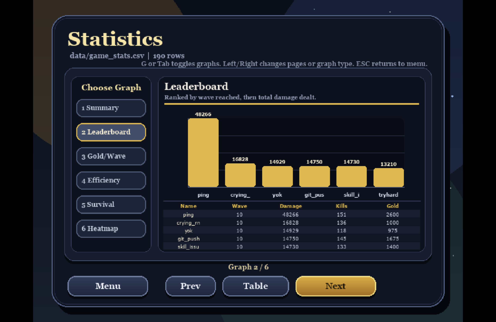
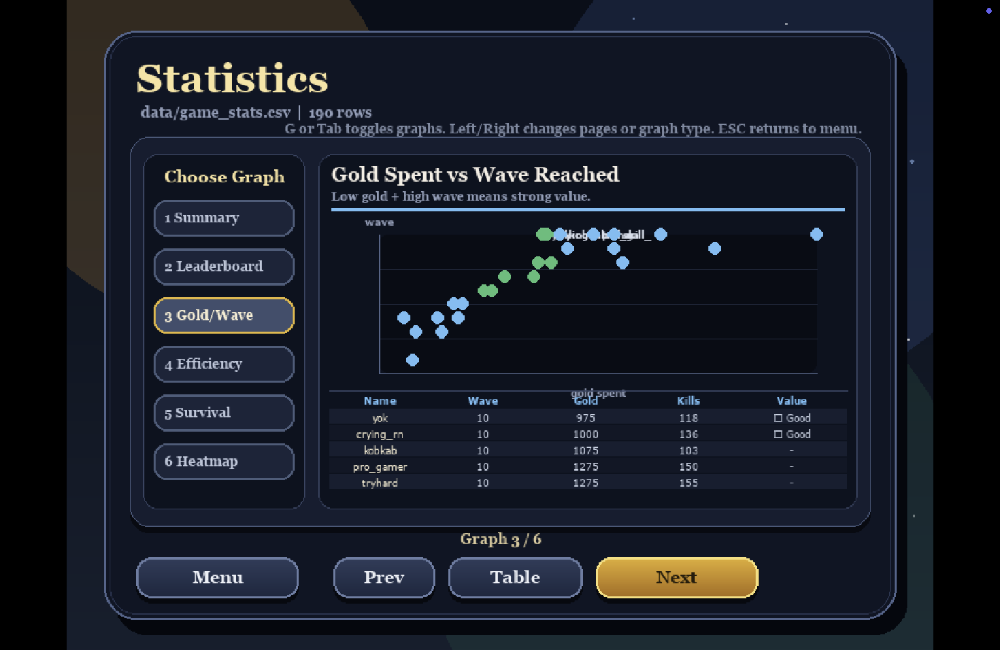
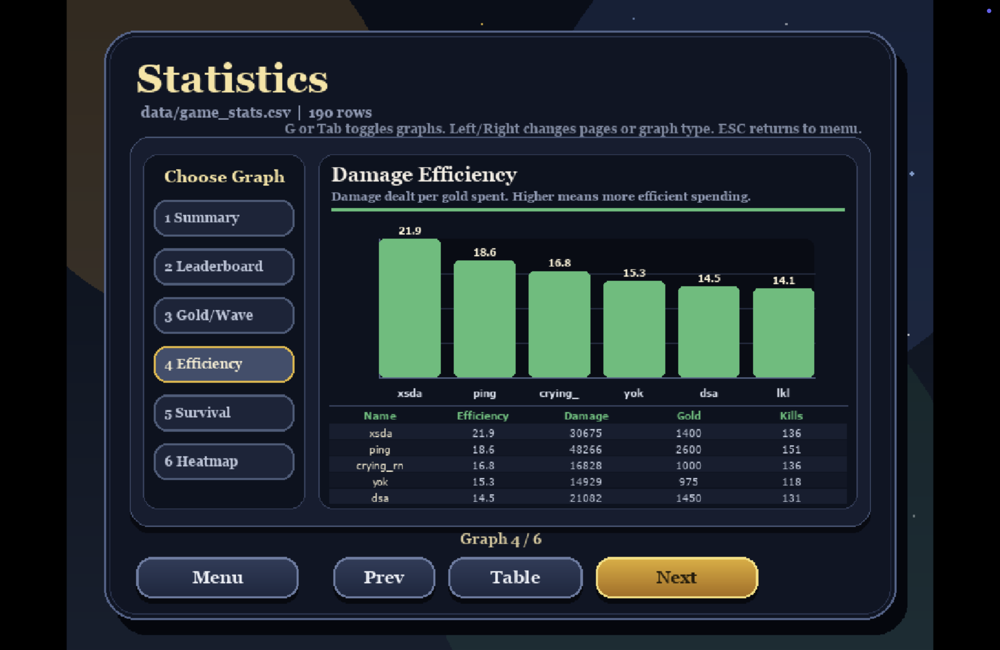

# Kingdom's Last Stand — Data Visualization Documentation

## What is this file?

This document explains every graph in the **Statistics** screen of **Kingdom's Last Stand** — a wave-based tower defense game built with Python and Pygame. Players place three types of towers (Archer, Mage, Cannon) to defend a castle across 10 escalating waves of enemies. After each wave, gameplay data is automatically saved to `data/game_stats.csv`. The Statistics screen reads this CSV and visualizes it across 6 interactive graphs, accessible from the Home screen.

---

## Overview

The Statistics screen contains **6 graphs**, selectable from the left sidebar. Each graph analyzes player performance from a different angle.

| # | Graph | Chart Type | What It Measures |
|---|---|---|---|
| 1 | Summary Table | Statistics Table | Mean, Median, Std Dev, Min, Max per metric |
| 2 | Leaderboard | Vertical Bar Chart | Top players ranked by wave reached then damage |
| 3 | Gold/Wave | Scatter Plot | Gold spending efficiency vs wave reached |
| 4 | Efficiency | Horizontal Bar Chart | Damage dealt per gold spent |
| 5 | Survival | Line Chart | Average castle HP across all waves |
| 6 | Heatmap | Cell Heatmap | How many players survived each wave |

**Navigation:** Press `1–6` to jump to a graph, `Left/Right` to cycle, `G` or `Tab` to switch between graph and raw table view.

---

## 1. Summary Table

**Chart type:** Statistics table
**Color:** Teal

The Summary Table is the starting point for understanding all recorded gameplay data. It shows six statistical values — **Feature, Mean, Median, Std Dev, Min, and Max** — for each of the five core metrics tracked per wave.

- **Enemies Defeated** has a Mean of 11.8 and a Median of 11.0, meaning most waves produce a consistent kill count. The Std Dev of 4.3 indicates moderate spread — some waves end with very few kills (Min 0, when a player lost early) while the best waves reached 21 kills.
- **Damage Dealt** shows the widest spread in the dataset. The Mean of 1,945 is nearly double the Median of 980, which reveals a strong right skew — a small number of exceptional late-game sessions with upgraded towers pull the average far above the typical result. The Max of 18,510 represents a single wave where a fully upgraded tower setup cleared a Boss wave with massive total output.
- **Gold Spent** has a Median of 125 gold per wave, which corresponds exactly to the cost of one Cannon Tower — meaning a typical wave involves exactly one purchase or upgrade decision. The Max of 950 gold in a single wave indicates players who bulk-bought towers before a Boss wave.
- **Castle HP** with a Median of 80 and a Min of 0 confirms that most players sustain moderate HP loss each wave, but Game Over events do happen. Players who maintained HP 100 throughout all 10 waves achieved a perfect defense.
- **Survival Time** averages 26.3 seconds per wave with a Min of 9 and Max of 62. Shorter times indicate waves cleared quickly by well-upgraded towers; longer times reflect Boss waves where a single enemy with 750 HP takes sustained fire before going down.

---

## 2. Leaderboard

**Chart type:** Vertical bar chart with mini-table
**Color:** Gold

The Leaderboard ranks every player who has played a session, sorted first by **highest wave reached** and then by **total damage dealt** as a tiebreaker. This ranking rewards players who survived the longest, then distinguishes them by how aggressively their towers performed.

The bar chart shows the top 6 players, with bar height representing total cumulative damage across all waves played. The mini-table below lists each player's Name, Wave, Damage, Kills, and Gold.

In the current dataset, the top player (shown as `□□□`) reached Wave 10 with 48,266 total damage — nearly three times the second-place player `crying_rn` at 16,828. This gap is significant: it shows that reaching Wave 10 alone is not enough to lead — how effectively a player's tower setup converts gold into damage determines the true ranking. Players like `touch_grass` and `git_push` both reached Wave 10 but spent less gold, while `□□□` invested heavily (2,600 gold) into a high-damage tower composition that maximized output on the toughest waves.

---

## 3. Gold Spent vs Wave Reached

**Chart type:** 2D scatter plot with mini-table
**Color:** Blue (normal) / Green (good value)

This scatter plot places every player as a single dot, with **total gold spent** on the X-axis and **highest wave reached** on the Y-axis. The goal is to reveal which players got the most wave progression out of the least gold — a measure of strategic efficiency rather than raw power.

Green dots are labeled **"Good"** — players who spent less than 40% of the maximum gold while reaching above 60% of the maximum wave. In the current data, `yok` (975 gold, Wave 10) and `crying_rn` (1,000 gold, Wave 10) both qualify as Good Value players, meaning they cleared all 10 waves while keeping spending lean. Players like `pro_gamer` and `tryhard` also reached Wave 10 but spent 1,275 gold each, placing them outside the Good Value threshold.

The cluster of blue dots in the upper-right area of the chart shows that most players who reached Wave 10 spent between 975–2,600 gold total. The scattered dots in the lower-left represent early-game losses — players who spent little gold but also failed before Wave 5, either due to poor tower placement or choosing the wrong tower type for the map.

---

## 4. Damage Efficiency

**Chart type:** Horizontal bar chart with mini-table
**Color:** Green

Damage Efficiency measures how much damage each player generated per gold spent, calculated as `Total Damage ÷ Total Gold`. This metric cuts through the noise of raw damage numbers and reveals which players had the sharpest decision-making when building their tower setup.

The current leaderboard is led by `xsda` at an efficiency of **21.9 damage per gold** — meaning every single gold coin spent returned 21.9 points of damage on average. `ping`, despite having the highest raw damage (48,266), scores only 18.6 efficiency because their large gold investment (2,600) dilutes the ratio. `crying_rn` at 16.8 and `yok` at 15.3 follow closely, consistent with their Good Value status in the Gold/Wave chart.

A high efficiency score typically indicates a player who invested in **Cannon Towers** (which deal splash damage hitting multiple enemies per shot) or who upgraded towers at the right time rather than buying additional towers they didn't need. Low efficiency — spending lots of gold for relatively modest damage — often reflects buying expensive Mage Towers primarily for their slow effect, which benefits castle survival more than raw damage output.

---

## 5. Survival Curve

**Chart type:** Line chart with data table
**Color:** Red

The Survival Curve tracks the **average castle HP remaining** at the end of each wave, aggregated across all players who reached that wave. It is the clearest picture of which waves are the most punishing and where most players start losing ground.

The line begins at Wave 1 with an average HP of 96 — nearly full health, since Wave 1 enemies (Slime, Goblin) are weak and most towers can handle them easily. The most significant drops occur at **Wave 2** (96 → 90) and **Wave 4** (90 → 71), where new enemy types with higher HP and speed force players to deal with threats their current tower setup may not handle efficiently. The data table confirms Wave 4 as the most dangerous wave in the dataset: Avg HP drops to 71 and the Min HP reaches 0, meaning at least one player lost their castle exactly on Wave 4.

The flat section between Waves 5–6 shows a temporary stabilization — players who survive the first Boss wave (Wave 5, Dragon with 750 HP) tend to use the gold reward to upgrade towers, which buoys average HP into the mid-game. The gradual decline from Wave 6 onward reflects increasing enemy HP scaling that eventually outpaces tower upgrades for most players.

---

## 6. Wave Survival Heatmap

**Chart type:** Cell heatmap with data table
**Color:** Bright yellow (many players) → Dark olive (few players)

The Wave Survival Heatmap answers one direct question: **how many players made it to each wave?** Each cell represents one wave. The number inside is the player count who reached that wave, and the cell brightness represents the survival rate — brighter yellow means more players survived to that wave.

From the current data of 28 unique players: Wave 1 has a 100% survival rate (28 players), which drops to 89% by Wave 3 (25 players). The sharpest single-wave drop occurs at **Wave 5**, where the count falls from 23 to 20 — a loss of 3 players (11%) in one wave, caused by the first Boss enemy. By Wave 7 only 16 players remain (57%), and Wave 10 is reached by just **8 players** (29% of all players who ever played).

The data table below shows the exact `Reach %` and `Drop from prev` for each wave, making it easy to identify the precise bottlenecks. The pattern reveals that the game's difficulty is front-loaded — most players who fail do so before Wave 6, and those who survive past the first Boss wave have a reasonable chance of reaching the end. Only the top third of the player base ever sees Wave 10.

---

## Data Tracked Per Wave

| Column | Description |
|---|---|
| `player_name` | Commander name entered at the Home screen |
| `wave_number` | Wave number (1–10) |
| `enemies_defeated` | Enemies killed during that wave |
| `damage_dealt` | Total damage output from all towers that wave |
| `gold_spent` | Gold spent on towers and upgrades that wave |
| `castle_hp` | Castle HP remaining at the end of the wave |
| `survival_time` | Time in seconds the wave took to complete |

Data is written to `data/game_stats.csv` automatically after every wave via `StatsTracker.save_to_csv()`. All six graphs read directly from this file at runtime with no preprocessing required.
