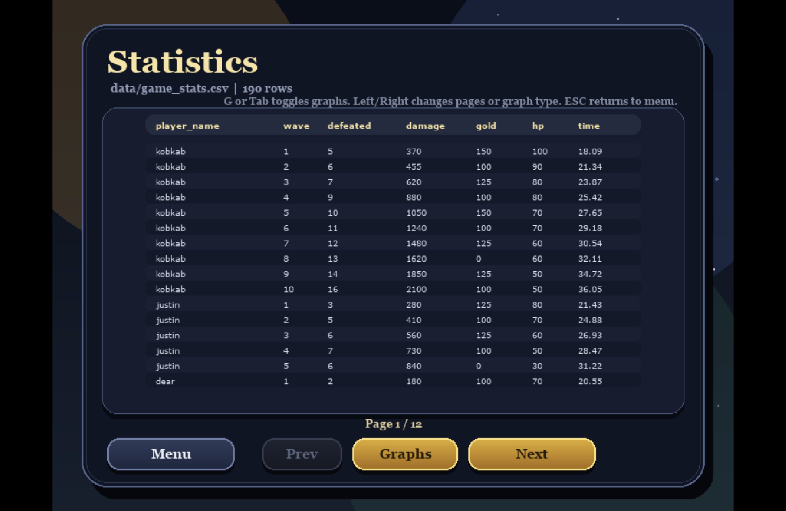

# Kingdom's Last Stand — Data Visualization Documentation

## What is this file?

This document explains every component in the **Statistics** screen of **Kingdom's Last Stand** — a wave-based tower defense game built with Python and Pygame. All gameplay data is automatically recorded to `data/game_stats.csv` after every wave. The Statistics screen reads this file at runtime and renders 6 interactive visualizations directly inside the game using matplotlib.

---

## Overall Statistics

The Statistics screen is accessible from the Home screen and displays all recorded session data across every player who has ever played. The left sidebar lists 6 graphs selectable by clicking or pressing keys 1–6. The main panel shows the selected graph along with a mini-table of supporting data. Navigation buttons at the bottom (Prev / Next) cycle through graphs, and the Table button toggles a raw CSV data view. The screen currently shows **190 rows** of data from multiple sessions.

---

## Graph 1 — Summary Table

**Chart type:** Statistics table | **Color:** Teal

The Summary Table shows six statistical values — **Mean, Median, Std Dev, Min, and Max** — for each of the five core metrics tracked per wave. Enemies Defeated has a Mean of 11.8 and Median of 11.0, showing consistent kill counts across most waves with the Max of 21 representing a fully upgraded tower setup clearing a late Boss wave. Damage Dealt has the widest spread (Std Dev 1,945), driven by exponential enemy HP scaling in late waves — the Max of 18,510 comes from a single wave against a wave-10 Boss. Gold Spent has a Median of 125 (exactly one Cannon Tower), meaning the typical wave involves a single purchase decision. Castle HP with Min 0 confirms Game Overs do happen, while players who held 100 throughout all 10 waves achieved a flawless defense. Survival Time averages 26.3 seconds, with longer times on Boss waves where a single enemy requires sustained tower fire before dying.

---

## Graph 2 — Leaderboard

**Chart type:** Vertical bar chart with mini-table | **Color:** Gold

The Leaderboard ranks players sorted first by highest wave reached, then by total damage dealt as a tiebreaker. Bar height represents cumulative damage across all waves in a session. The current top player `ping` reached Wave 10 with 48,266 total damage — nearly three times second-place `crying_rn` at 16,828. This gap reveals that reaching Wave 10 is not enough to lead: the composition and timing of tower purchases determines how much damage a setup generates over a full run. The mini-table below the chart lists each player's Wave, Damage, Kills, and Gold, making it easy to compare spending habits between top performers.

---

## Graph 3 — Gold Spent vs Wave Reached

**Chart type:** 2D scatter plot with mini-table | **Color:** Blue / Green

Each dot represents one player, placed by total gold spent (X-axis) and highest wave reached (Y-axis). Green dots are marked **Good** — players who spent under 40% of the maximum gold while reaching above 60% of the maximum wave. `yok` (975 gold, Wave 10) and `crying_rn` (1,000 gold, Wave 10) qualify as Good Value players, clearing all 10 waves with lean spending. Players like `pro_gamer` and `tryhard` also reached Wave 10 but at 1,275 gold each, just outside the Good threshold. The cluster of blue dots in the upper-right shows that most Wave-10 players spent between 975–2,600 gold total. Scattered low dots in the lower-left represent early losses where players either had no time to spend gold or placed towers poorly.

---

## Graph 4 — Damage Efficiency

**Chart type:** Horizontal bar chart with mini-table | **Color:** Green

Damage Efficiency is calculated as `Total Damage ÷ Total Gold Spent` and shows how much damage each gold coin returned. `xsda` leads at **21.9 damage per gold** with 30,675 damage from only 1,400 gold — a lean, high-output build. `ping` has the highest raw damage (48,266) but ranks second at 18.6 efficiency because their 2,600 gold investment dilutes the ratio. `crying_rn` at 16.8 and `yok` at 15.3 follow, consistent with their Good Value placement in the Gold/Wave scatter. High efficiency typically indicates a Cannon Tower-heavy build — Cannon's splash damage hits multiple enemies per shot, maximizing damage per gold spent. Low efficiency often reflects Mage Tower investment, whose slow effect benefits castle HP but does not appear in raw damage numbers.

---

## Graph 5 — Survival Curve

**Chart type:** Line chart with data table | **Color:** Red

The Survival Curve tracks average castle HP remaining at the end of each wave across all 29 players who reached Wave 1. The line starts at 96 average HP at Wave 1, drops to 90 at Wave 2, holds through Wave 3 at 77, and reaches its lowest point at **Wave 4 with 71 average HP and a Min of 0** — confirming Wave 4 as the most lethal wave in the dataset, where at least one player lost their castle entirely. The slight recovery at Wave 5 (average 72) reflects players who survived the first Boss wave earning enough gold to upgrade towers before Wave 6. The total of 701 accumulated HP across all waves and a peak of 96 show that strong early defense sets the foundation for late-game survival.

---

## Graph 6 — Wave Survival Heatmap

**Chart type:** Cell heatmap with data table | **Color:** Bright yellow → Dark olive

Each cell shows how many players reached that wave, with brightness representing the survival rate — brighter yellow means more players, darker olive means fewer. Out of 28 total players: Wave 1 has 100% survival (28 players), dropping to 89% by Wave 3 (25 players). The sharpest single-wave drop is at **Wave 5**, where the Boss Dragon causes 3 players (11%) to lose their castle in one wave. By Wave 7 only 16 players remain (57%), and Wave 10 is reached by just **8 players (29%)**. The data table shows exact Reach % and Drop from prev for each wave, making it easy to identify that the biggest difficulty spike is at Waves 4–5 — exactly where new enemy types (Orc, Boss) appear for the first time.
